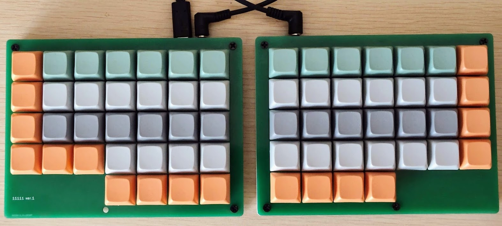

# 11111

Splitted, Cherry MX switch, 64 keys, ortholinear mechanical keyboard.

MCU: [Waveshare RP2040-zero](https://www.waveshare.com/wiki/RP2040-Zero)  
Firmware: [KMK firmware](https://github.com/KMKfw/kmk_firmware)  

